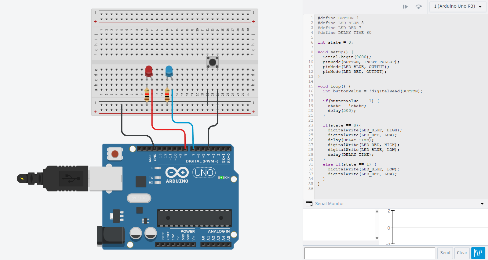

# Arduino Fundamentals — August 11

This lesson marks the transition into hands-on IoT work with an Arduino. The exercises begin with basic digital input and output before moving on to sensors and a small automated parking-gate project.

## Circuit simulation with Tinkercad

[Tinkercad Circuits](https://www.tinkercad.com/) provides a convenient way to assemble and test Arduino circuits virtually before wiring physical components. It can simulate an Arduino Uno, breadboard components, and the uploaded sketch while also providing a Serial Monitor for debugging.

Simulating a circuit first helps verify:

- Pin assignments
- Component polarity and connections
- Basic program logic
- Expected input and output behavior

## Pushbutton-controlled LED circuit

The introductory circuit uses a pushbutton and two LEDs. Pressing the button toggles between two operating states:

- In the active state, the red and blue LEDs alternate rapidly.
- In the inactive state, both LEDs remain off.

The button uses Arduino's internal pull-up resistor, so an unpressed button reads `HIGH` and a pressed button reads `LOW`. The sketch inverts that reading to make a press easier to treat as a true condition.

### Pin assignments

| Component | Arduino pin | Mode |
| --- | --- | --- |
| Pushbutton | Digital 4 | `INPUT_PULLUP` |
| Red LED | Digital 7 | `OUTPUT` |
| Blue LED | Digital 8 | `OUTPUT` |

Each LED must be connected in series with a current-limiting resistor. The pushbutton connects the input pin to ground when pressed.

## Arduino program structure

An Arduino sketch normally contains two main functions:

- `setup()` runs once after the board powers on or resets. Use it to configure pins, start serial communication, and establish initial states.
- `loop()` runs repeatedly while the board is powered. Use it to read inputs, update state, and control outputs.

This circuit also demonstrates a simple state variable. When the program detects the button in its pressed state, it flips the stored value to turn the LED behavior on or off.

> The example uses `delay(500)` to reduce rapid toggling from button bounce. Because it checks the button level rather than detecting the press edge, holding the button down can still toggle the state again every half-second. A release check or non-blocking `millis()`-based debounce would provide more reliable one-toggle-per-press behavior.

## Sensor and parking-gate practice

The lesson's Arduino sketches are documented in the [Arduino project README](arduino_project/README.md):

- `sensortest` reads raw echo timing from an HC-SR04 ultrasonic sensor.
- `parking_gate` combines ultrasonic vehicle detection, a servo-operated gate, and audible event signals.
