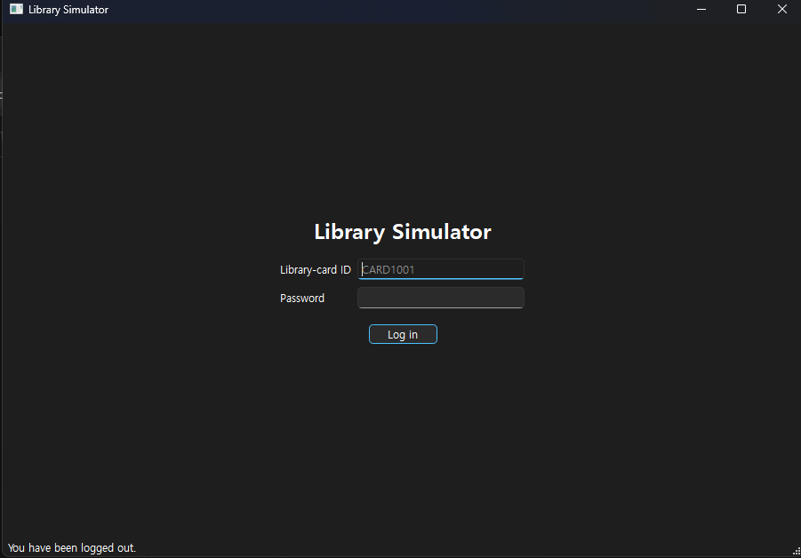
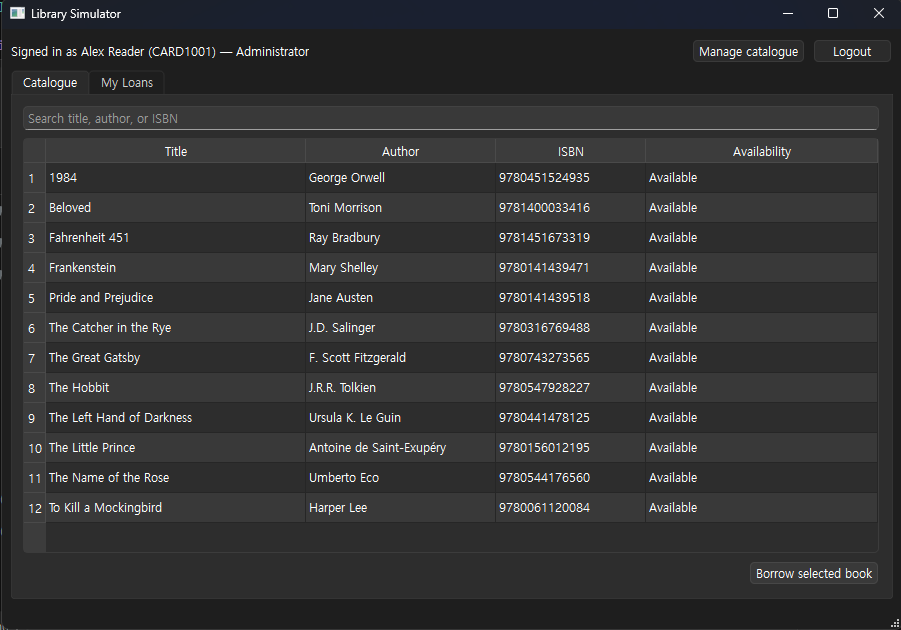
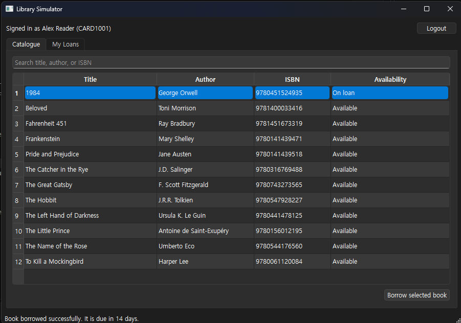
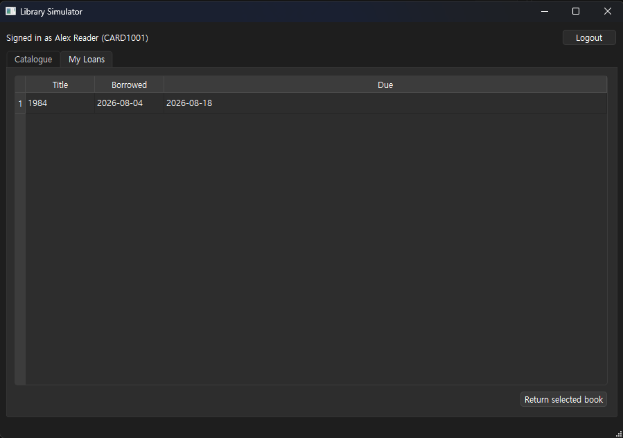
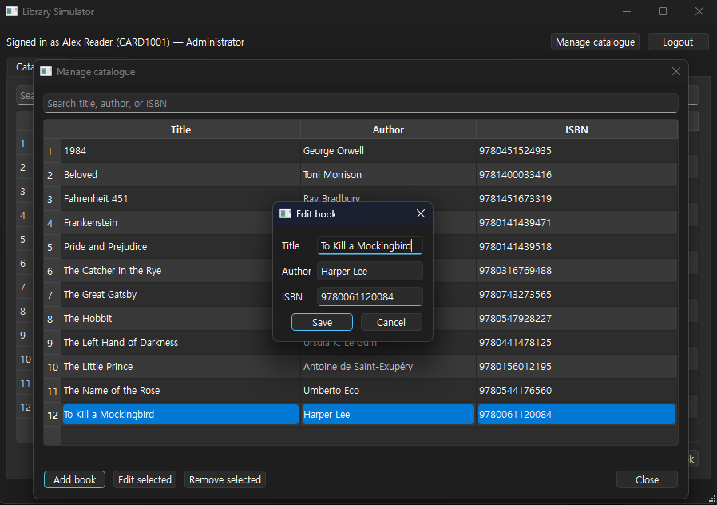

# Library Simulator

A small Windows-compatible desktop library exercise built with PySide6 Qt
Widgets, a Python service layer, and a persistent SQLite database. Users can log
in, search the seeded catalogue, borrow up to three books, view their active
loans, and return books. Administrators can also add, edit, and remove catalogue
entries, including selecting multiple entries for removal.

## Screenshots

| Login | Catalogue |
| --- | --- |
|  |  |
| Borrow a book | My loans |
|  |  |

### Manage catalogue



## Demo logins

| Library-card ID | Password | Name | Role |
| --- | --- | --- | --- |
| `CARD1001` | `lib123` | Alex Reader | Administrator |
| `CARD1002` | `book123` | Sam Booker | Member |

Passwords are stored as salted PBKDF2 hashes. The users and 12-book catalogue
are seeded automatically when `library.db` is first created.

The **Manage catalogue** button is available only to administrators. Removed
books are archived rather than permanently deleted, preserving current and
historical loan records.

## Install and run

Python 3.11 or newer is required. From PowerShell in this directory:

```powershell
py -m venv .venv
.venv\Scripts\python.exe -m pip install -r requirements.txt
.venv\Scripts\python.exe main.py
```

The SQLite database is saved as `library.db` beside the source files. Delete that
file to reset the demo data.

Run the service tests without starting the GUI:

```powershell
python -m unittest discover -s tests -v
```

## Windows executable

Run:

```powershell
build_windows.bat
```

PyInstaller writes the application to `dist\LibrarySimulator`. This repository
includes the build command but does not include a platform-specific executable.
