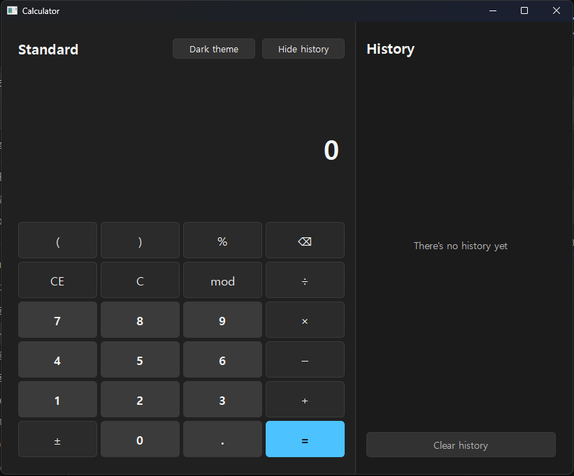
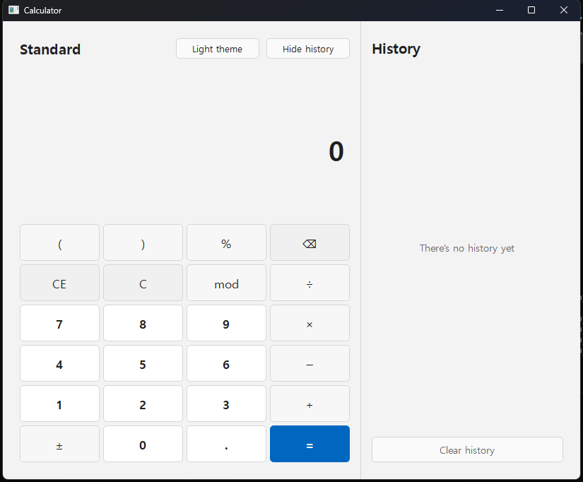

# Windows Calculator

A Python/PySide6 Qt Widgets calculator inspired by the modern Windows Calculator.
It accepts a complete editable expression and applies ordinary mathematical
precedence rather than calculating each button press strictly left to right.

## Screenshots

| Dark theme | Light theme |
| --- | --- |
|  |  |

## Requirements

- Windows with Python 3.12 or newer
- [`uv`](https://docs.astral.sh/uv/) for the documented setup

Dependencies are installed into the project-local `.venv`; no global package
installation is required.

## Set up and run

From PowerShell in the project directory:

```powershell
uv sync
uv run python main.py
```

Run the automated tests with:

```powershell
uv run pytest
```

## Controls

The calculator supports digits, decimal values, `+`, `−`, `×`, `÷`, `mod`,
parentheses, unary percentage, and sign toggling.

Use the theme button beside **Standard** to switch the complete interface between
light and dark themes.

Long expressions and decimal results wrap onto additional lines instead of
expanding horizontally; a vertical scrollbar appears only when needed. Use the
**Hide history** / **Show history** button to toggle the history panel, which is
visible by default.

- `C` clears the full expression.
- `CE` removes the current number while retaining the preceding expression.
- `⌫` removes the last character or operator.
- `±` toggles the sign of the current number.
- `%` is a unary operation: `10%` evaluates to `0.1`.
- `mod` calculates a remainder at the same precedence as multiplication and division.

The expression is limited to 512 characters. After `=`, typing a number starts a
new expression, while entering an operator continues from the calculated result.

Keyboard input:

| Key | Action |
| --- | --- |
| `0`–`9`, `.` | Enter a number |
| `+`, `-`, `*`, `/` | Enter an operator |
| `(`, `)`, `%` | Enter the corresponding expression element |
| `M` | Enter `mod` |
| `Enter` or `=` | Calculate |
| `Backspace` | Delete the previous input |
| `Delete` | Clear the current number (`CE`) |
| `Escape` | Clear everything (`C`) |

## History

The latest 20 successful calculations are stored in memory, newest first. Select
an entry to load its result for another calculation. **Clear history** removes all
entries. History is not persisted after the application closes, and errors or
unfinished expressions are never recorded.

## Architecture

```text
main.py                  Application entry point
calculator/
  engine.py              Tokenizer, recursive-descent evaluator, and input state
  history.py             Qt-independent bounded history model
  window.py              PySide6 widgets and input routing
tests/
  test_engine.py         Evaluation and expression-editing tests
  test_history.py        History model tests
  test_window.py         Headless Qt integration tests
```

`calculator.engine` contains no GUI objects. The tokenizer produces a small set
of arithmetic tokens, and a recursive-descent parser implements this grammar:

```text
expression := term (("+" | "-") term)*
term       := unary (("×" | "÷" | "mod") unary)*
unary      := ("+" | "-") unary | postfix
postfix    := primary ("%")*
primary    := number | "(" expression ")"
```

Calculations use `Decimal` with a fixed precision and never call Python `eval()`.
The separation between tokenizer, parser, editable state, history, and widgets is
intended to make a later C++/Qt Widgets translation straightforward.
